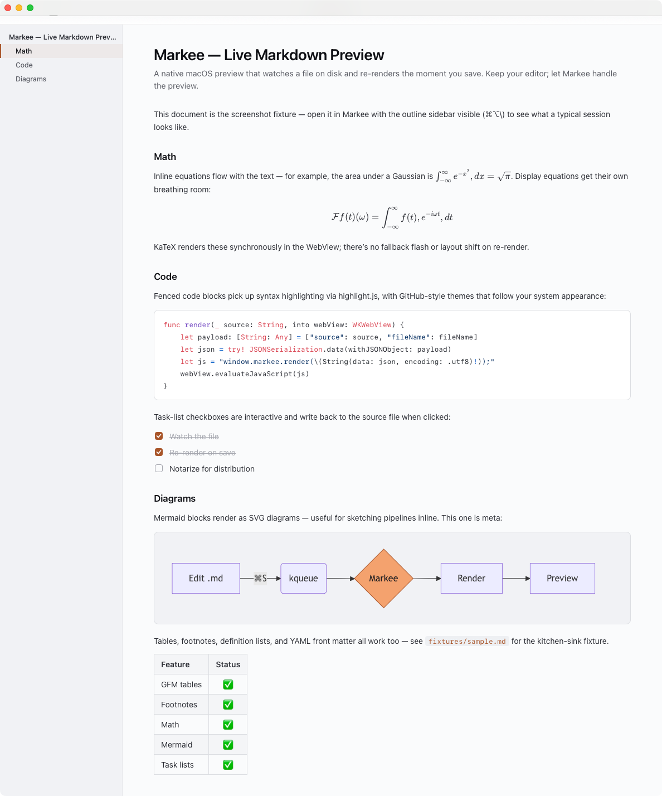

<div>
  
  <h1 align="center">Markee</h1>
</div>
A native macOS Markdown preview app that watches a file on disk and re-renders
the moment you save. **Editor-agnostic** — keep using Vim, VS Code, Cursor,
Zed, JetBrains, Sublime, or whatever else you already love; let Markee handle
the preview.

**Website:** [markee.sbang.dev](https://markee.sbang.dev)

<p align="center">
  <picture>
    <source media="(prefers-color-scheme: dark)" srcset="docs/screenshots/window-dark.png">
    <source media="(prefers-color-scheme: light)" srcset="docs/screenshots/window-light.png">
    
  </picture>
</p>

## Why Markee?

Most Mac Markdown apps want to be your editor too — and that means picking
between their text-editing experience and the one you've already tuned for
years. Markee skips the fight: it's a *preview*. You edit in the editor you
know, save the file, and the rendered view updates instantly. Want to jump
back to a heading you're scrolled to? Right-click it in the outline → **Open
in Editor**, and your editor opens at that line.

## Features

- Live re-render on save, with scroll position preserved.
- Works with editors that do atomic saves (Vim, VS Code, Cursor, Zed,
  Sublime, JetBrains, …).
- GitHub-flavored Markdown plus footnotes, definition lists, attribute
  lists, task lists, YAML front matter.
- KaTeX math (inline `$…$` and display `$$…$$`).
- Syntax highlighting via highlight.js.
- Mermaid diagrams.
- **Interactive task-list checkboxes** that write back to the source file.
- **Open in Editor at Current Heading** — ⌥⌘E or right-click an outline row
  to jump to that heading's source line in your editor.
- Outline sidebar with live active-heading highlight (⌘⌥\\ to toggle).
- Export Standalone HTML with inlined CSS + images (⌘E).
- ⌘F find in preview, ⌘P print or save as PDF.
- Light + dark themes, follows `prefers-color-scheme`.
- CLI launcher: `markee path/to/notes.md`.

## Install

### Recommended: prebuilt `.app`

Download `Markee.app.zip` from the latest
[GitHub Release](https://github.com/sethbangert/markee/releases), unzip, drag
into `/Applications`.

**First launch — Gatekeeper warning.** Markee is ad-hoc codesigned, not
notarized with an Apple Developer ID yet. The first time you open it, macOS
will say *"`Markee` can't be opened because Apple cannot check it for
malicious software."* Two ways past it:

- **Right-click** `Markee.app` in Finder → **Open** → **Open** in the dialog.
  You only need to do this once; subsequent launches go straight through.
- Or, in Terminal: `xattr -dr com.apple.quarantine /Applications/Markee.app`,
  then double-click as normal.

Notarization is on the roadmap.

### From source

```sh
make fetch-vendor   # one-time: pinned downloads of markdown-it, KaTeX, highlight.js, Mermaid
make app            # builds Markee.app at the repo root
make run            # builds + opens
make install        # copies to /Applications
```

Subsequent `make app` invocations skip the vendor fetch (sentinel-based).

## Use

Any of these opens a file:

- Drag a `.md` onto the Markee dock icon.
- File ▸ Open… (⌘O).
- `open Markee.app yourfile.md`.
- After installing the CLI (File ▸ Install Command Line Tool…):
  `markee yourfile.md`.

Then edit the file in your editor. Save. The preview updates.

## Keyboard shortcuts

| Shortcut | Action |
|----------|--------|
| ⌘O | Open file |
| ⌘W | Close window |
| ⌘⌥\\ | Toggle outline sidebar |
| ⌘E | Export Standalone HTML |
| ⌥⌘E | Open in Editor at current heading |
| ⌘F | Find in preview |
| ⌘P | Print / save as PDF |

## Open-in-Editor configuration

Markee auto-detects the first available editor from this list on your `PATH`
(via your login shell, so Homebrew / fnm / asdf entries work):

```
cursor → code → zed → subl → mate → mvim → hx
```

Override by setting a preference:

```sh
defaults write com.markee.preview editor "zed"
```

For each editor, Markee constructs the right "jump to line" syntax —
`code -g path:line:col`, `zed path:line:col`, `subl path:line`,
`mate -l line path`, `mvim +line path`, `hx path:line`. The full list of
supported editors is in `Sources/Markee/EditorLauncher.swift`.

## Develop

```sh
make test         # swift test + node --test (Swift + JS)
make test-swift   # FileWatcher, SchemeHandler, PreviewController, EditorLauncher
make test-js      # util.js (collectTaskLineNumbers, slugify, pickActiveHeading)
make clean        # nuke .build, Markee.app, and Resources/web/vendor
```

48 tests passing at HEAD (24 Swift + 24 JS).

### Project layout

```
Sources/Markee/        Swift app (SwiftUI DocumentGroup + WKWebView)
Resources/web/         HTML/JS/CSS shipped into the bundle
  template.html        Loads vendor + util + app
  app.js               Renderer glue, scroll preservation, message bridge
  util.js              Pure helpers (importable by Node tests)
  theme.css            Light/dark theme
  vendor/              Fetched at build time, not committed
Resources/cli/markee   Shell launcher
Resources/AppIcon.svg  Source for the app icon
scripts/               build-icon.sh, fetch-vendor.sh
Tests/                 Swift + JS tests
fixtures/sample.md     Exercises every feature
docs/demo.md           README hero document
```

### How it works (briefly)

The Swift side is a thin host: a `DocumentGroup`, a per-window
`PreviewController`, a `FileWatcher` (kqueue with atomic-save reattach), and
two custom URL scheme handlers — `markee-app://` for bundle assets and
`markee-doc://` for the current document's directory (sandboxed against path
traversal *and* symlink escape). All Markdown rendering happens in JavaScript
inside the WebView; Swift just streams the file's source into
`window.markee.render({…})` after every change.

## Requirements

- macOS 13 (Ventura) or later.
- Apple Silicon (untested on Intel — should work but no CI for it).
- Swift 5.9+ (ships with Xcode 15 / the Command Line Tools).
- Node ≥ 18 (only needed to run the JS test suite).

## Status

v0.2.0 — Soft Modern UI/UX redesign + Open in Editor + security hardening.
See [CHANGELOG.md](CHANGELOG.md) for the full release history. Not yet signed
with a Developer ID or notarized.

## Contributing

This is a small personal project. Issues and focused PRs are welcome; for
anything larger than a small fix, please open an issue first so we can talk
through the approach. See [CONTRIBUTING.md](CONTRIBUTING.md).

For security reports, see [SECURITY.md](SECURITY.md).

## License

[MIT](LICENSE). Markee bundles a handful of third-party JS/CSS libraries
under their own permissive licenses — see
[THIRD-PARTY-NOTICES.md](THIRD-PARTY-NOTICES.md) for the full texts.

## Credits

Built on the shoulders of
[markdown-it](https://github.com/markdown-it/markdown-it),
[KaTeX](https://katex.org),
[highlight.js](https://highlightjs.org),
and [Mermaid](https://mermaid.js.org).
The macOS-app shell is plain SwiftUI + WKWebView.
