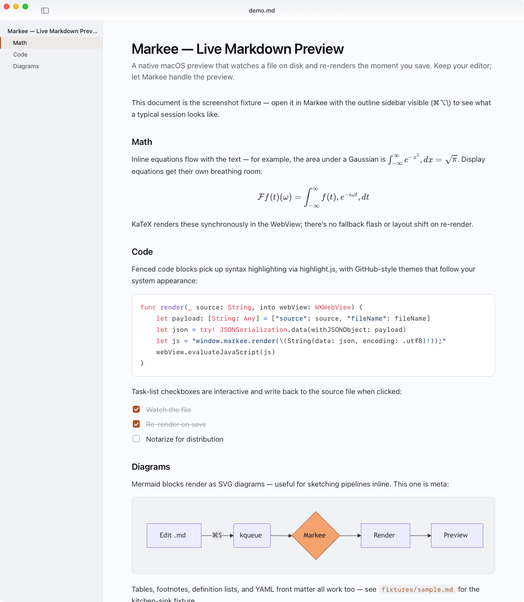

<div>
  
  <h1 align="center">Markee</h1>
</div>
A native macOS Markdown preview app that watches a file on disk and re-renders
the moment you save. **Editor-agnostic** — keep using Vim, VS Code, Cursor,
Zed, JetBrains, Sublime, or whatever else you already love; let Markee handle
the preview.

**Website:** [markee.sbang.dev](https://markee.sbang.dev)

<p align="center">
  <picture>
    <source media="(prefers-color-scheme: dark)" srcset="docs/screenshots/window-dark.png">
    <source media="(prefers-color-scheme: light)" srcset="docs/screenshots/window-light.png">
    
  </picture>
</p>

## Why Markee?

Most Mac Markdown apps want to be your editor too — and that means picking
between their text-editing experience and the one you've already tuned for
years. Markee skips the fight: it's a *preview*. You edit in the editor you
know, save the file, and the rendered view updates instantly. Want to jump
back to a heading you're scrolled to? Right-click it in the outline → **Open
in Editor**, and your editor opens at that line.

## Features

- Live re-render on save, with scroll position preserved.
- Works with editors that do atomic saves (Vim, VS Code, Cursor, Zed,
  Sublime, JetBrains, …).
- GitHub-flavored Markdown plus footnotes, definition lists, attribute
  lists, task lists, YAML front matter.
- KaTeX math (inline `$…$` and display `$$…$$`).
- Syntax highlighting via highlight.js.
- Mermaid diagrams.
- **Quick Look** — press Space on a `.md` file in Finder for a fully rendered
  preview instead of raw text.
- **Finder thumbnails & document icon** — `.md` files show a thumbnail of
  their rendered content, and carry a branded Markee document icon.
- **Interactive task-list checkboxes** that write back to the source file.
- **Open in Editor at Current Heading** — ⌥⌘E or right-click an outline row
  to jump to that heading's source line in your editor.
- Outline sidebar with live active-heading highlight (⌘⌥\\ to toggle).
- Export Standalone HTML with inlined CSS + images (⌘E).
- ⌘F find in preview, ⌘P print or save as PDF.
- **In-window navigation** — click `.md` links to move between files with
  Back/Forward (⌘[ / ⌘]), a sidebar file tree, `[[wiki-links]]`, and a
  workspace-wide search palette (⇧⌘O).
- **Window pinning** — float a window on top (⌥⌘P), keep it on all Spaces, or
  use ghost mode to dim it until you hover.
- Light + dark themes, following `prefers-color-scheme`, plus a **Preferences**
  window (⌘,) to override the theme, accent color, base font size, and load a
  custom CSS file.
- **Optional supporter license** — Markee is free and fully featured; nothing is
  gated. Supporting only quiets an occasional nudge.
- CLI launcher: `markee path/to/notes.md`.

## Install

### Recommended: prebuilt `.app`

Download `Markee.app.zip` from the latest
[GitHub Release](https://github.com/sethbang/markee/releases), unzip, drag
into `/Applications`.

Release builds are Developer ID signed and notarized, so they open normally
with a double-click — no Gatekeeper warning, no right-click workaround needed.

### From source

```sh
just fetch-vendor   # one-time: pinned downloads of markdown-it, KaTeX, highlight.js, Mermaid
just app            # builds Markee.app at the repo root
just run            # builds + opens
just install        # copies to /Applications
```

Subsequent `just app` invocations skip the vendor fetch (sentinel-based). Run `just` to list every recipe.

## Use

Any of these opens a file:

- Drag a Markdown file onto the Markee dock icon.
- File ▸ Open… (⌘O).
- File ▸ Open Folder as Workspace… to set a folder as the navigation root.
- `open Markee.app yourfile.md`.
- After installing the CLI (File ▸ Install Command Line Tool…):
  `markee yourfile.md`.

Then edit the file in your editor. Save. The preview updates.

### Workspaces

Opening a single file quietly establishes a *workspace* around it — the root
Markee uses to resolve the file tree, `[[wiki-links]]`, and ⇧⌘O search. The root
is inferred from the file you open: the enclosing git repository if there is
one, otherwise the nearest parent folder holding more than one Markdown file,
otherwise the file's own folder. Use **File ▸ Open Folder as Workspace…** to set
it explicitly.

## Keyboard shortcuts

| Shortcut | Action |
|----------|--------|
| ⌘O | Open file |
| ⌘W | Close window |
| ⌘, | Preferences |
| ⌘⌥\\ | Toggle outline sidebar |
| ⌘[ / ⌘] | Back / forward |
| ⇧⌘O | Search workspace |
| ⌘R | Reload from disk |
| ⌘+ / ⌘= | Zoom in |
| ⌘- | Zoom out |
| ⌘0 | Actual size |
| ⌘E | Export Standalone HTML |
| ⇧⌘E | Export PDF |
| ⌥⌘E | Open in Editor at current heading |
| ⇧⌘C | Copy Markdown source |
| ⇧⌘R | Reveal in Finder |
| ⌘F | Find in preview |
| ⌘G / ⇧⌘G | Find next / previous |
| ⌘P | Print / save as PDF |
| ⌥⌘P | Float window on top |

## Open-in-Editor configuration

Markee auto-detects the first available editor from this list on your `PATH`
(via your login shell, so Homebrew / fnm / asdf entries work):

```
cursor → code → zed → subl → mate → mvim
```

Override it in **Markee ▸ Settings ▸ General ▸ Editor**, or with a preference
(a bare command name, not a path):

```sh
defaults write com.markee.preview editor "zed"
```

For each editor, Markee constructs the right "jump to line" syntax —
`code -g path:line:col`, `zed path:line:col`, `subl path:line`,
`mate -l line path`, `mvim +line path`. The full list of supported editors is
in `Sources/Markee/EditorLauncher.swift`. Terminal editors (`nvim`, `vim`,
`hx`, …) aren't supported: Markee launches the editor without a terminal, so
use a GUI build such as `mvim`.

## Develop

```sh
just test         # swift test + node --test (Swift + JS)
just test-swift   # Swift unit tests (XCTest)
just test-js      # JS pure-helper + render-snapshot + wiki-link tests
just clean        # nuke .build, Markee.app, and Resources/web/vendor
just reset        # wipe local state + relaunch a fresh, un-licensed install
```

168 tests passing at HEAD (131 Swift + 37 JS).

### Project layout

```
Sources/Markee/        Swift app (SwiftUI DocumentGroup + WKWebView)
  Workspace*.swift     Workspace root + file tree, search, and back/forward
  NavigationHistory.swift  Pure back/forward stack
Sources/MarkeeKit/     Shared library: renderer, scheme handlers, file reader
Sources/MarkeeQuickLookPreview/    Quick Look preview extension (.appex)
Sources/MarkeeQuickLookThumbnail/  Quick Look thumbnail extension (.appex)
Resources/web/         HTML/JS/CSS shipped into the bundle
  template.html        Loads vendor + util + render-core + app
  app.js               Renderer glue, scroll preservation, message bridge
  render-core.js       markdown-it pipeline (also used by Node snapshot tests)
  util.js              Pure helpers (importable by Node tests)
  theme.css            Light/dark theme
  vendor/              Fetched at build time, not committed
Resources/cli/markee   Shell launcher
Resources/AppIcon.svg  Source for the app icon
scripts/               build-icon.sh, fetch-vendor.sh, sign-app.sh, notarize-app.sh
Tests/                 Swift + JS tests
fixtures/sample.md     Exercises most rendering features
docs/demo.md           README hero document
```

### How it works (briefly)

The Swift side is a thin host: a `DocumentGroup`, a per-window
`PreviewController`, a `FileWatcher` (kqueue with atomic-save reattach), and
two custom URL scheme handlers — `markee-app://` for bundle assets and
`markee-doc://` for files under the workspace root (the enclosing git repo or
docs folder; sandboxed against path traversal *and* symlink escape — see
[SECURITY.md](SECURITY.md)). All Markdown rendering happens in JavaScript
inside the WebView; Swift just streams the file's source into
`window.markee.render({…})` after every change.

## Requirements

- macOS 13 (Ventura) or later.
- Apple Silicon (untested on Intel — should work but no CI for it).
- Swift 5.9+ (ships with Xcode 15 / the Command Line Tools).
- Node ≥ 18 (only needed to run the JS test suite).

## Status

v1.0.0 — see [CHANGELOG.md](CHANGELOG.md) for the full release history.
Developer ID signed and notarized.

## Contributing

This is a small personal project. Issues and focused PRs are welcome; for
anything larger than a small fix, please open an issue first so we can talk
through the approach. See [CONTRIBUTING.md](CONTRIBUTING.md).

For security reports, see [SECURITY.md](SECURITY.md).

## License

[MIT](LICENSE). Markee bundles a handful of third-party JS/CSS libraries
under their own permissive licenses — see
[THIRD-PARTY-NOTICES.md](THIRD-PARTY-NOTICES.md) for the full texts.

**Using Markee at work?** Markee is free for everyone, companies included. If
your team wants priority support and a commercial support agreement on file, see
[COMMERCIAL.md](COMMERCIAL.md).

## Credits

Built on the shoulders of
[markdown-it](https://github.com/markdown-it/markdown-it),
[KaTeX](https://katex.org),
[highlight.js](https://highlightjs.org),
and [Mermaid](https://mermaid.js.org).
The macOS-app shell is plain SwiftUI + WKWebView.
