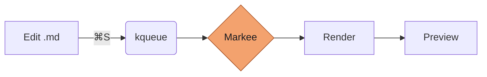

# Markee — Live Markdown Preview

A native macOS preview that watches a file on disk and re-renders the moment
you save. Keep your editor; let Markee handle the preview.

This document is the screenshot fixture — open it in Markee with the outline
sidebar visible (⌘⌥\\) to see what a typical session looks like.

## Math

Inline equations flow with the text — for example, the area under a Gaussian
is $\int_{-\infty}^{\infty} e^{-x^2}\,dx = \sqrt{\pi}$. Display equations get
their own breathing room:

$$
\mathcal{F}\{f(t)\}(\omega) = \int_{-\infty}^{\infty} f(t)\,e^{-i\omega t}\,dt
$$

KaTeX renders these synchronously in the WebView; there's no fallback flash
or layout shift on re-render.

## Code

Fenced code blocks pick up syntax highlighting via highlight.js, with
GitHub-style themes that follow your system appearance:

```swift
func render(_ source: String, into webView: WKWebView) {
    let payload: [String: Any] = ["source": source, "fileName": fileName]
    let json = try! JSONSerialization.data(withJSONObject: payload)
    let js = "window.markee.render(\(String(data: json, encoding: .utf8)!));"
    webView.evaluateJavaScript(js)
}
```

Task-list checkboxes are interactive and write back to the source file when
clicked:

- [x] Watch the file
- [x] Re-render on save
- [ ] Notarize for distribution

## Diagrams

Mermaid blocks render as SVG diagrams — useful for sketching pipelines
inline. This one is meta:



Tables, footnotes, definition lists, and YAML front matter all work too — see
`fixtures/sample.md` for the kitchen-sink fixture.

| Feature      | Status |
|--------------|:------:|
| GFM tables   | ✅ |
| Footnotes    | ✅ |
| Math         | ✅ |
| Mermaid      | ✅ |
| Task lists   | ✅ |
