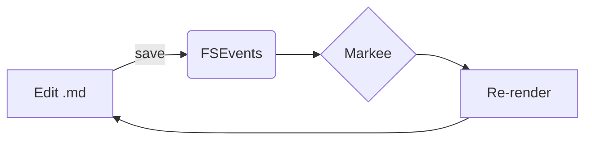

# Markee Sample

A quick fixture covering the v1 feature set.

## Text formatting

Plain **bold**, *italic*, ~~strikethrough~~, `inline code`, and a [link](https://example.com).

> A blockquote. Useful for asides.

## Lists

- Bullet one
- Bullet two
  - Nested

1. Ordered
2. Ordered

## Task list

- [x] Watch file
- [x] Re-render on save
- [ ] Notarize for distribution

## Table

| Feature | Status |
|---------|:------:|
| GFM tables | ✅ |
| Footnotes  | ✅ |
| Math       | ✅ |
| Mermaid    | ✅ |

## Code

```python
def hello(name: str) -> str:
    return f"Hello, {name}!"
```

## Math

Inline: $a^2 + b^2 = c^2$.

Display:

$$
\int_0^\infty e^{-x^2}\,dx = \frac{\sqrt{\pi}}{2}
$$

## Mermaid



## Footnote

Here is a claim that needs a citation.[^1]

[^1]: This is the footnote text.

## Definition list

Markdown
:   A lightweight markup language.

WKWebView
:   Apple's modern WebView, used here for rendering.
